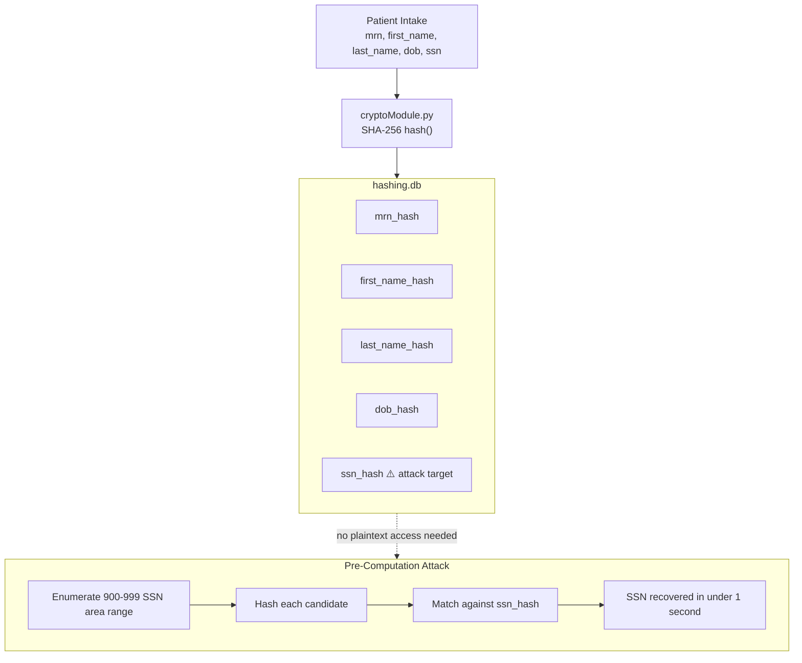
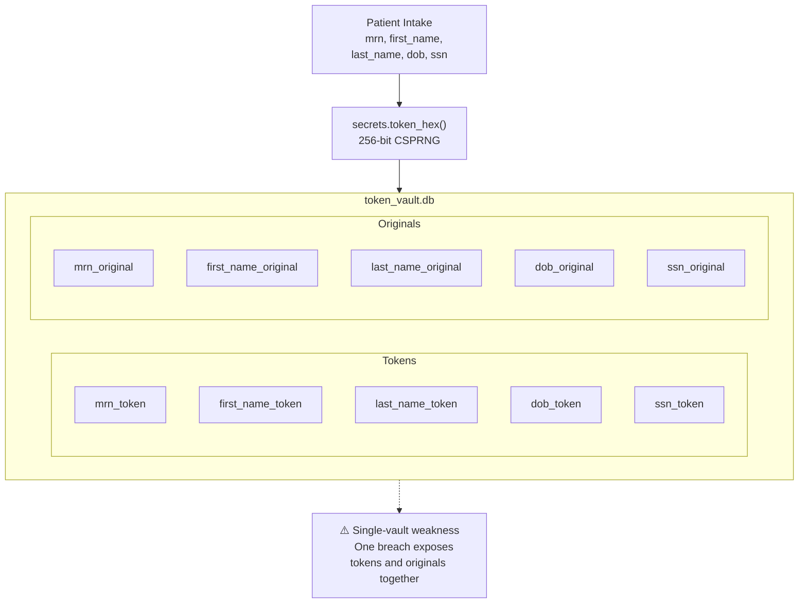
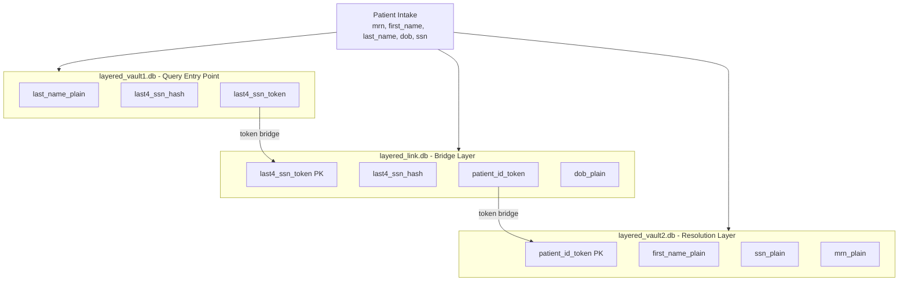
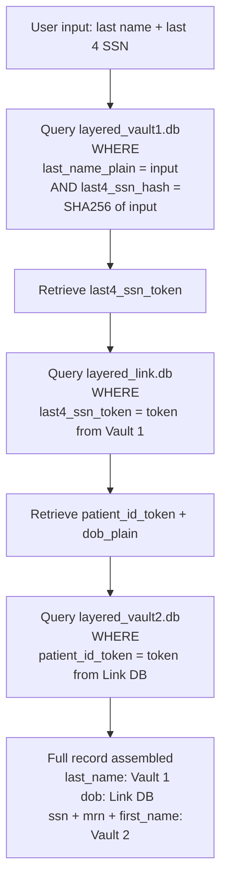

# ClearChart - PII Protection Architecture

> **WGU C769 IT Capstone Project** · Python · Flask · SQLite

A proof of concept comparing three PII protection approaches applied to synthetic patient data in a simulated EHR intake system.

> ⚠️ All patient data is entirely synthetic. SSNs use the 900–999 area range which the SSA has never assigned.

---

## Quick Start

**Step 1 - Clone the repository and install dependencies**

```bash
git clone https://github.com/TheRealBastioul/clearchart.git
cd clearchart
pip install flask
```

**Step 2 - Generate synthetic patient data**

```bash
python generatePatients.py
```

**Step 3 - Build the pipeline databases**

```bash
python pipelineHashing.py
python piplineTokenization.py
python piplineLayered.py
```

**Step 4 - Start the web interface**

```bash
python demo.py
```

Open `http://127.0.0.1:5000` in a browser.

**Step 5 - Run the pre-computation attack demonstration (optional)**

```bash
python attackDemo.py
```

> ⚠️ `pii.db` is a demo-only seed file for generating synthetic records. In a real deployment, patient data would be written directly into the pipeline databases at intake.

---

## Architecture

### Pipeline 1 - Direct Hashing



---

### Pipeline 2 - Tokenization



---

### Pipeline 3 - Layered Tokenization-Plus-Hashing

#### Data Creation



#### Query Flow



**Breach exposure per database:**
- Vault 1: last name + partial SSN hash only
- Link DB: DOB + opaque tokens, no name or SSN
- Vault 2: SSN + MRN + first name, dead end without Link DB token

---

## Pipeline Comparison

| Property | Hashing | Tokenization | Layered |
|---|---|---|---|
| Pre-computation attack | ❌ Vulnerable | ✅ Not feasible | ✅ Not feasible |
| Single-breach exposure | ❌ High | ❌ High | ✅ Partial record only |
| Query complexity | Simple | Simple | Three hops |
| Reversibility | ❌ One-way | ✅ Vault lookup | ✅ Token chain |

---

## Author

Vincent (Bast) Herrera · [github.com/TheRealBastioul](https://github.com/TheRealBastioul) · [dimensionbeyond.space](https://dimensionbeyond.space)

*WGU B.S. Cybersecurity and Information Assurance - C769 IT Capstone*
